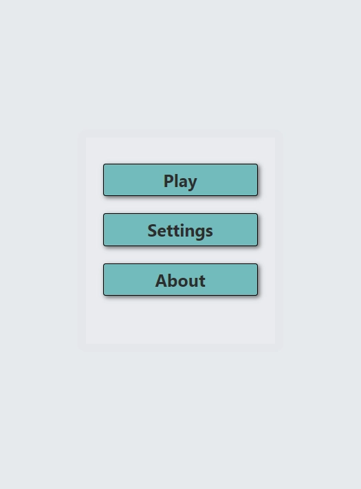
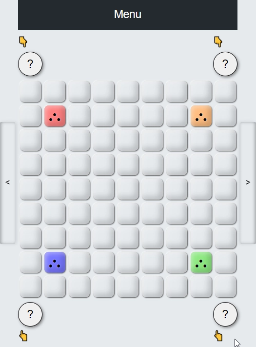

# The points

A simple Single-Page application in React.
Server not yet implemented.

Read about game [here](./client/ABOUT.md)

## Technology stack

### Client

    <a href="https://wikipedia.org/wiki/HTML5" target="_blank"
        ></a
    >&nbsp;
    <a href="https://www.typescriptlang.org" target="_blank"
        ></a
    >&nbsp;
    <a href="https://reactjs.org" target="_blank"
        ></a
    >&nbsp;
    &nbsp;
    &nbsp;

## Demo (see [live](https://egas099.github.io/points) demo)

    <a href=""
        ></a
    >&nbsp;
    <a href=""
        >

